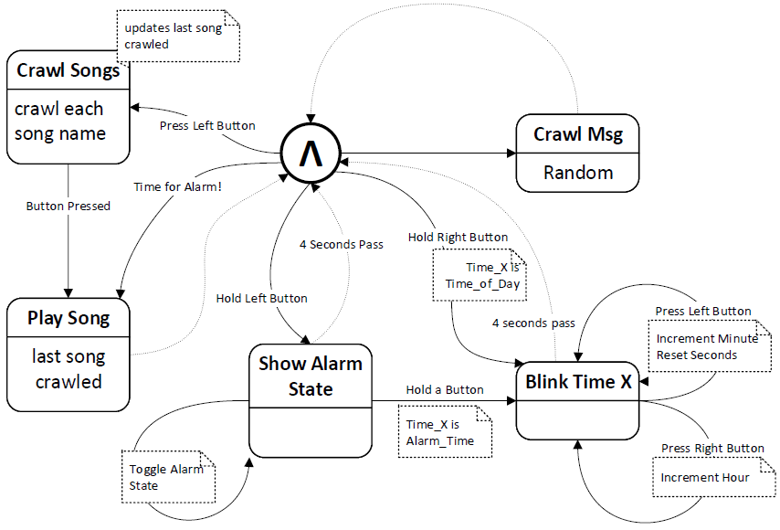
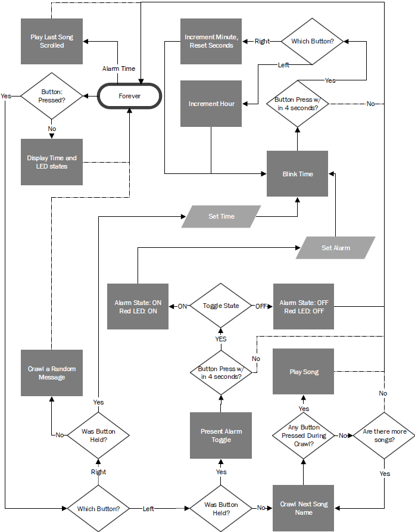
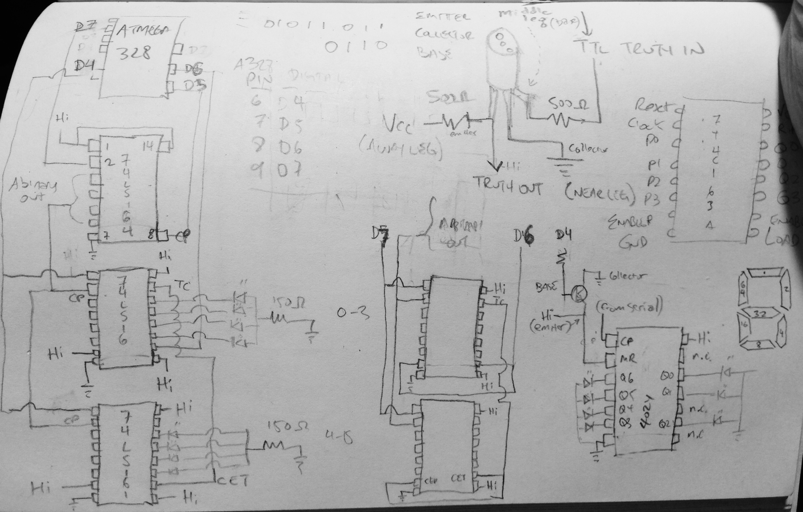

Nate's Clock

A bedside clock for my son Nate! This is a simple program which works with an Arduino burned Atmel and a hand full of old counter chips (74L516 and 4024) I had lying around, some 7 segment LEDs, an oxford comma, and a speaker. The Atmel flashed as an Arduino (Duemilanove) is the micro for this 'Alarm Clock'. It shows the time, scrolls 'secret' messages, and plays two different songs through the speaker. You can get the gist of what it does by looking at the state chart below.

Here is a similar depiction using a procedural flow diagram, note how all dotted lines connect back to "forever"

A video of the "computer" before it went in the case is here: https://www.youtube.com/watch?v=rpshfs3g9n4 . As you can see it was casually constructed using what I had. The display basically takes serial to parallel ripple counters where the output of the counters goes to segments in the 7 segment LEDs. To set a digit or character, you count up to the permutation of digit segments you want turned on. For example if we give the right most segments the value 2 and 4 from the output counter, we just count up to 6 and stop to show the digit "1". One or two digits were done with 74L516 counters, and one or two were done with 4024 counters, and the leftmost digit was simple tied directly to the port pins of the micro. Very slap-shod, if I had it to do again for some kind of professional project, I would do it with all 4024's and have some kind of latch so you wouldn't see the number segments counting up to the correct segment permuatation. For hobby stuff though, doing it like I did makes it glitchy, and glitchy is fun for a casual project.

 I'm software oriented and getting better at hw daily, but you can tell from this hand drawn schematic I worked from that I am still on my hw journey:
 

I put the whole thing in a custom enclosure using more scavenged parts for specialized look. Hopefully you can reuse some of this, like the digit encoding (how to make an 'a' with 7 segments etc.) in your own projects. Btw: As 7 segments is pretty limited, I hack 'm' and 'w' with 'n' and 'u' (respectively) only with a line over the top. Meh. Also there is some basic code to play a couple songs you might pinch. Help yourself, happy coding.

